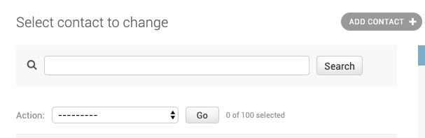
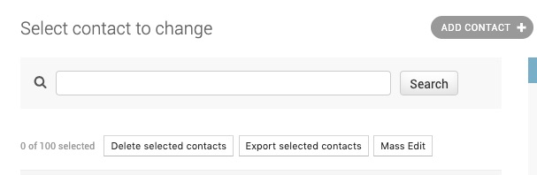

# django-admin-action-buttons

Replaces the default action dropdown with buttons

Before:



After:




## Installation

1. `pip install django-admin-action-buttons`
2. Add `'admin_action_buttons',` to `INSTALLED_APPS`
3. See "Usage" below.


## Usage

There are two ways to apply django-admin-action-buttons change:
 1. Blanket-style to all models in the admin
 2. Selectively

### Blanket

To apply the change across the entire admin:

 1. Add `'admin_action_buttons.context_processors.admin_action_buttons'` to `context_processors`
    For example:
    ``` python
    TEMPLATES = [
        {
            "BACKEND": "django.template.backends.django.DjangoTemplates",
            "OPTIONS": {
                "context_processors": [
                    # defaults:
                    "django.template.context_processors.debug",
                    "django.template.context_processors.request",
                    "django.contrib.auth.context_processors.auth",
                    "django.contrib.messages.context_processors.messages",
                    # custom:
                    "admin_action_buttons.context_processors.admin_action_buttons",
                ],
            },
        },
    ] 
    ```
    Docs: https://docs.djangoproject.com/en/3.1/topics/templates/#django.template.backends.django.DjangoTemplates
    The default list is documented here: https://docs.djangoproject.com/en/3.1/topics/templates/#django.template.backends.django.DjangoTemplates
    
 2. Make sure that `admin_action_buttons` in `INSTALLED_APPS` comes BEFORE `django.contrib.admin`

The blanket change cen be disabled via settings:

``` python
ADMIN_ACTION_BUTTONS_ALWAYS = False
```
    
### Selective

Add the mixin to any `ModelAdmin` you wish to tweak:

```
from admin_action_buttons import ActionButtonsMixin

class MyModelAdmin(ActionButtonsMixin, admin.ModelAdmin):
    ...
    
```

Alternatively, you can add the JS media file directly:
```
class MyModelAdmin(admin.ModelAdmin):
    ...
    
    class Media:
        js = [
            ...
            'admin_action_buttons/admin_action_buttons.js',
        ]
        css = {
            'all': [
                'admin_action_buttons/admin_action_buttons.css',
                ...
            ],
        }
```

## Implementation

This is a pure JS & CSS implementation.

Please report any problems via Github issues. PRs welcome.
 